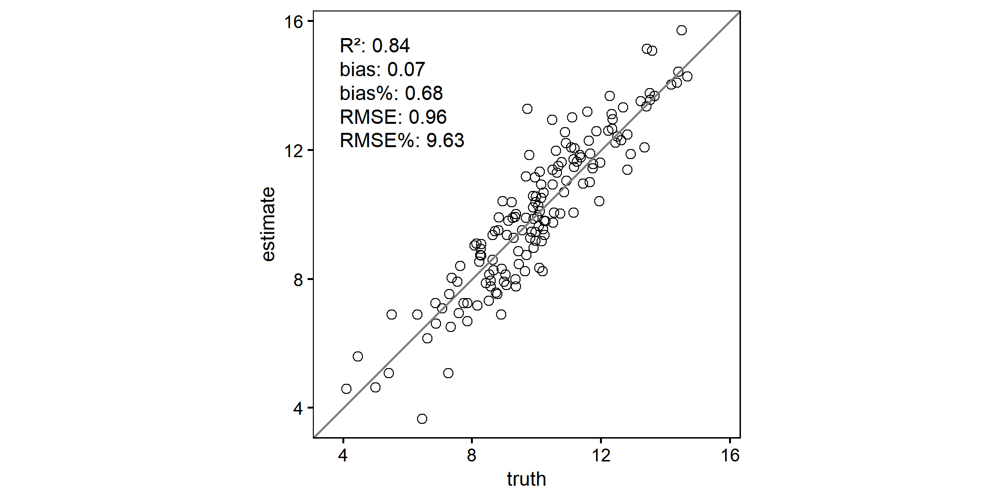
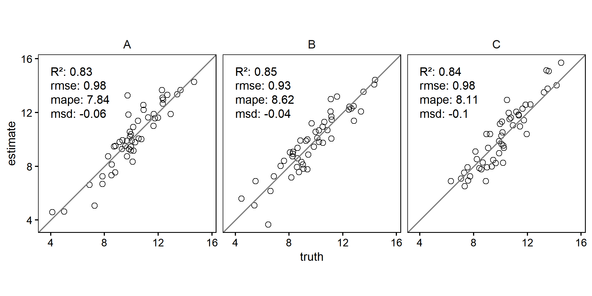
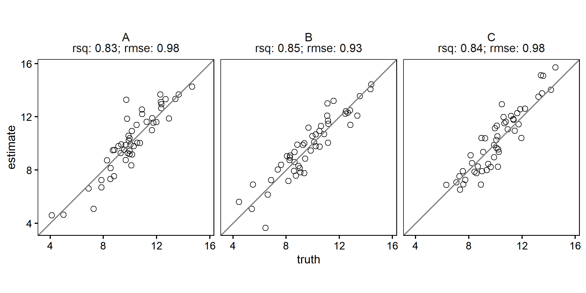
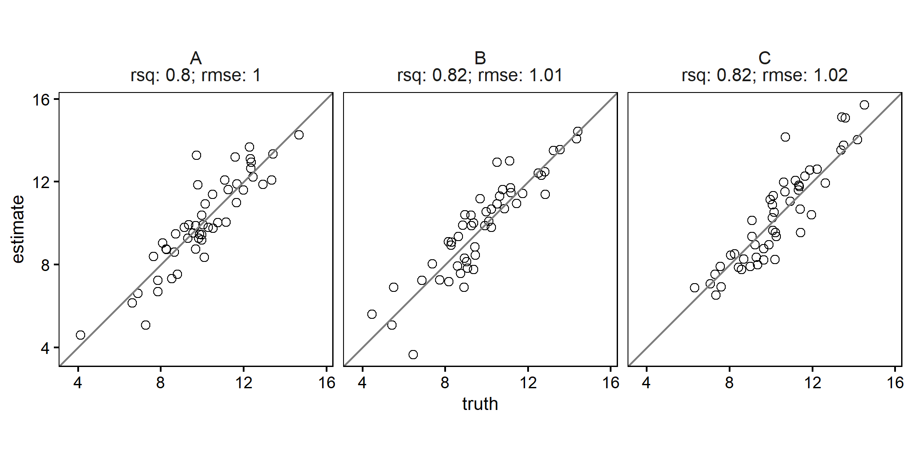
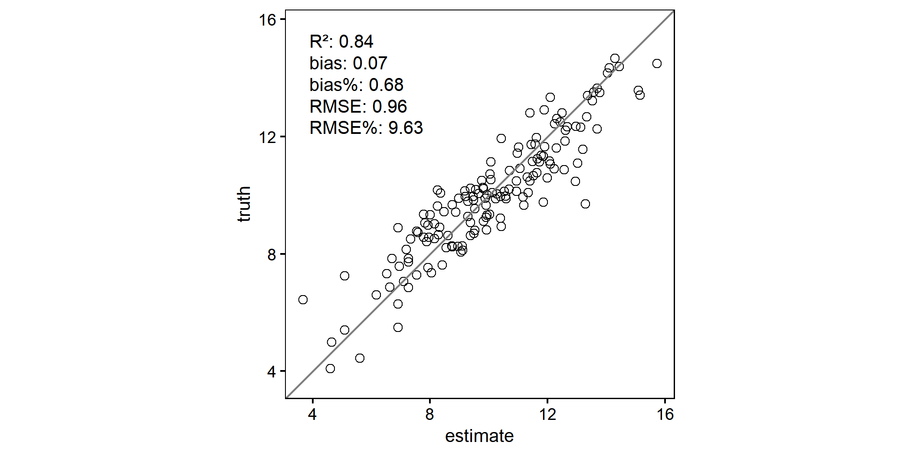
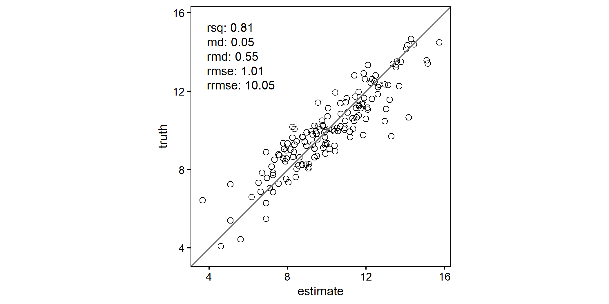
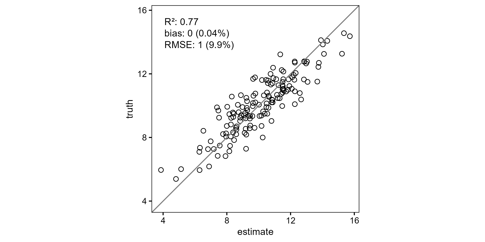

<!-- README.md is generated from README.Rmd. Please edit that file -->

# {scatter}

[](https://github.com/ptompalski/scatter/actions/workflows/R-CMD-check.yaml)
[](https://app.codecov.io/gh/ptompalski/scatter?branch=master)

This package provides functions for quickly calculating measures of
model prediction accuracy and creating enhanced scatterplots. The
scatterplots can include text summarizing the agreement metrics (e.g.,
R², RMSE, MAPE) between two plotted variables, with support for grouped
data and faceting. Agreement metrics are sourced from the
[{yardstick}](https://yardstick.tidymodels.org/index.html) package and
can be further customized by the user.

# Why?

Scatterplots are one of the most frequently used visualizations in my
daily work. While creating a scatterplot is straightforward, I wanted a
version that would meet these specific needs:

- Ensure the plot is always square.
- Include a 1:1 reference line.
- Provide an optional text panel showing agreement statistics, allowing
  an easy customization of the metrics included.
- Seamlessly handle grouped data, creating faceted plots with minimal
  effort.
- Automatically switch to density-colored points to reduce overplotting

# Installation

``` r
devtools::install_github("ptompalski/scatter")
library(scatter)
```

# Examples

Simple scatterplot with the default set of named agreement metrics:

``` r
library(dplyr)
library(scatter)
library(yardstick)
library(ggplot2)

# some fake data
df <- 
tibble(
  truth = c(rnorm(150, 10, 2)),
  estimate = truth + rnorm(150,0, 1),
  group = rep(c("A", "B", "C"), each = 50),          
  group2 = rep(c("D1", "D2"), each = 75),          
)

scatter(df, truth, estimate)
```



Scatterplot for grouped data with agreement metrics:

This example uses a named list so the annotation labels are explicit:

``` r
df %>%
  group_by(group) %>%
  scatter(truth, estimate, metrics=list("R²"=rsq,rmse,mape,msd))
```



Scatterplot for grouped data with agreement metrics positioned outside
the plots:

The same approach works when positioning metrics outside the panels:

``` r
df %>%
  group_by(group) %>%
  scatter(truth, estimate, metrics=list(rsq,rmse), metrics_position = "outside")
```



Paired metrics can be displayed together in the annotation label:

``` r
df %>%
  group_by(group) %>%
  scatter(
    truth,
    estimate,
    metrics = list(
      "R²" = metric_format(rsq, "{value:.2f}"),
      RMSE = metric_pair(rmse, rrmse, "{value:.1f} ({percent:.0f}%)"),
      bias = metric_pair(md, rmd, "{value:.1f} ({percent:.1f}%)")
    )
  )
```



Outside metric labels can be split across multiple lines, which is
useful when including several metrics:

``` r
df %>%
  group_by(group) %>%
  scatter(
    truth,
    estimate,
    metrics = list(
      "n" = metric_format(n_obs, "{value:.0f}"),
      "R²" = metric_format(rsq, "{value:.2f}"),
      RMSE = metric_pair(rmse, rrmse, "{value:.1f} ({percent:.0f}%)"),
      bias = metric_pair(md, rmd, "{value:.1f} ({percent:.1f}%)")
    ),
    metrics_position = "outside",
    metrics_nlines = 2
  )
```



## Scatterplots with large datasets

When working with large datasets, heavy overplotting can obscure the
underlying data distribution and make it difficult to identify
systematic patterns, biases, or outliers. To address this, `scatter()`
supports density-colored points (`ggpointdensity::geom_pointdensity()`).
This approach colors points by their local density, revealing the
structure of dense regions while still retaining individual
observations.

The example below compares a standard scatterplot with a density-colored
version for the same large dataset.

``` r
library(patchwork)
set.seed(123)
df2 <- tibble(
  truth = rnorm(50000, 20, 4),
  estimate = truth + rnorm(50000, 0, 2)
)

p1 <- scatter(
  df2, truth, estimate,
  point_style = "point",
  points_alpha = 0.3,
  points_size = 1
) +
  ggtitle("Standard scatterplot")

p2 <- scatter(
  df2, truth, estimate,
  point_style = "pointdensity",
) +
  ggtitle("Density-colored scatterplot")

p1 + p2
```



For convenience, `scatter()` can also switch to this behavior
automatically using `point_style = "auto"` (default), which enables
density coloring once the number of observations exceeds a configurable
threshold.

## Axis orientation: observed vs. predicted

By default, `scatter()` places observed (truth) values on the x-axis and
predicted (estimate) values on the y-axis. This follows recommendations
in the modelling literature, but users can easily switch back to the
alternative convention (predicted on x) using `swap_axes = TRUE`.

The most influential position on this topic, published by [Piñeiro et
al. (2008)](https://www.sciencedirect.com/science/article/pii/S0304380008002305),
argues that observed values should be placed on the x-axis to improve
the interpretability of regression diagnostics and model evaluation,
based on the idea that predictions are conditioned on observations.
However, [Pauwels et
al. (2019)](https://www.sciencedirect.com/science/article/pii/S0304380019303102?via%3Dihub)
subsequently revisited this argument and pointed out that parts of this
reasoning are conceptually flawed, showing that the choice of axis
orientation does not have a universally correct solution and can
influence interpretation depending on the modelling context and
analytical objective.

Importantly, axis orientation in `scatter()` affects only the
visualization; agreement metrics are always computed using the original
(truth, estimate) pairing (compare the figure below with the top-most
scatterplot):

``` r
scatter(df, truth, estimate, swap_axes = TRUE)
```


