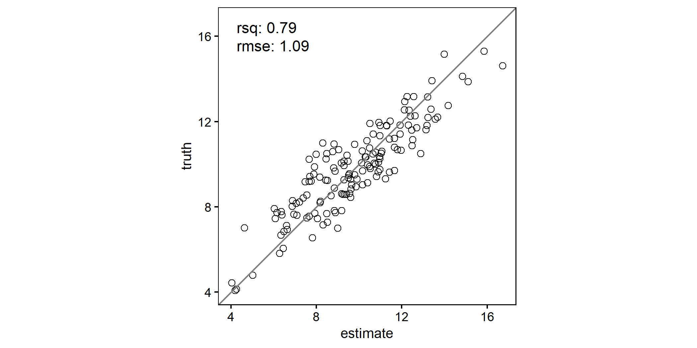
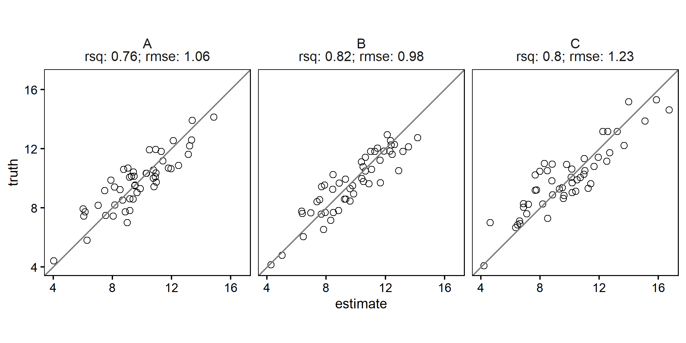

<!-- README.md is generated from README.Rmd. Please edit that file -->

# {scatter}

This package provides functions for quickly calculating measures of
model prediction accuracy and creating enhanced scatterplots. The
scatterplots can include text summarizing the agreement metrics (e.g.,
R², bias, RMSE) between two plotted variables, with support for grouped
data and faceting.

# Why?

Scatterplots are one of the most frequently used visualizations in my
daily work. While creating a scatterplot is straightforward, I wanted a
version that would meet these specific needs:

- Ensure the plot is always square.
- Include a 1:1 reference line.
- Display “predicted” values on the x-axis.
- Provide an optional text panel showing agreement statistics.
- Seamlessly handle grouped data, creating faceted plots with minimal
  effort.

# Installation

``` r
devtools::install_github("ptompalski/scatter")
library(scatter)
```

# Features

- Calculate Model Prediction Accuracy: Use `agreement_metrics()` to
  compute metrics like R2, bias and RMSE.

- Generate Scatterplots: Use `scatter()` to generate scatterplots with
  optional agreement metrics text annotations, faceting for grouped
  data.

# Examples

Simple scatterplot

``` r
library(dplyr)
library(ggplot2)
library(scatter)

# some fake data
df <- 
tibble(
  observed = c(rnorm(150, 10, 2)),
  predicted = observed + rnorm(150,0, 1),
  group = rep(c("A", "B", "C"), each = 50)          
)

scatter(df, observed, predicted)
```

<!-- -->

Scatterplot with agreement metrics

``` r
scatter(df, observed, predicted, add_metrics = TRUE)
```

<!-- -->

Grouped scatterplot with agreement metrics

``` r
df %>%
  group_by(group) %>%
  scatter(observed, predicted, add_metrics = TRUE)
```

<!-- -->
