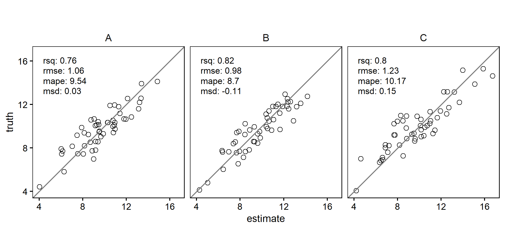

<!-- README.md is generated from README.Rmd. Please edit that file -->

# {scatter}

This package provides functions for quickly calculating measures of
model prediction accuracy and creating enhanced scatterplots. The
scatterplots can include text summarizing the agreement metrics (e.g.,
R², RMSE, MAPE) between two plotted variables, with support for grouped
data and faceting. Agreement metrics are sourced from the
[{yardstick}](https://yardstick.tidymodels.org/index.html) package and
can be further customized by the user.

# Why?

Scatterplots are one of the most frequently used visualizations in my
daily work. While creating a scatterplot is straightforward, I wanted a
version that would meet these specific needs:

- Ensure the plot is always square.
- Include a 1:1 reference line.
- Display “predicted” values on the x-axis.
- Provide an optional text panel showing agreement statistics, allowing
  an easy customization of the metrics included.
- Seamlessly handle grouped data, creating faceted plots with minimal
  effort.

# Installation

``` r
devtools::install_github("ptompalski/scatter")
library(scatter)
```

# Examples

Simple scatterplot with R² and RMSE

``` r
library(dplyr)
library(scatter)

# some fake data
df <- 
tibble(
  truth = c(rnorm(150, 10, 2)),
  estimate = truth + rnorm(150,0, 1),
  group = rep(c("A", "B", "C"), each = 50),          
  group2 = rep(c("D1", "D2"), each = 75),          
)

scatter(df, truth, estimate, metrics=list(rsq,rmse))
```

<!-- -->

Scatterplot for grouped data with agreement metrics

``` r
df %>%
  group_by(group) %>%
  scatter(truth, estimate, metrics=list(rsq,rmse,mape,msd))
```

<!-- -->

Scatterplot for grouped data with agreement metrics positioned outside
the plots.

``` r
df %>%
  group_by(group) %>%
  scatter(truth, estimate, metrics=list(rsq,rmse), metrics_position = "outside")
```

<!-- -->
